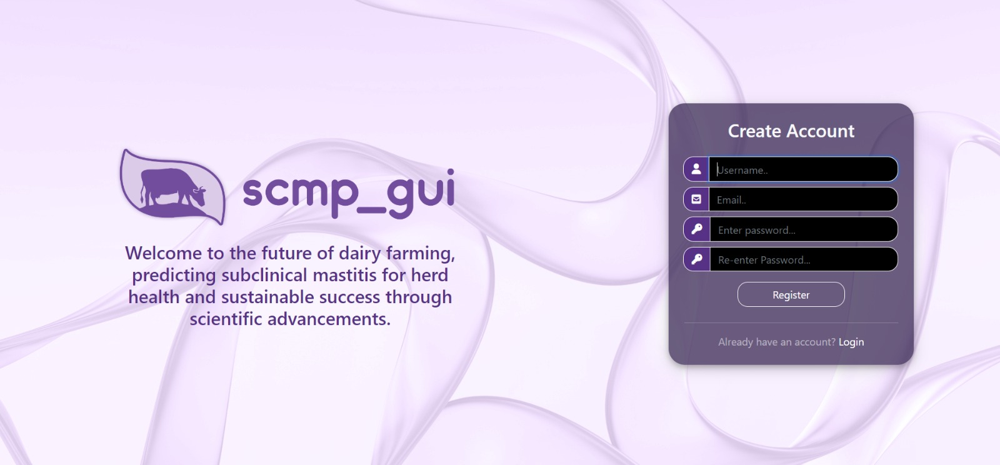
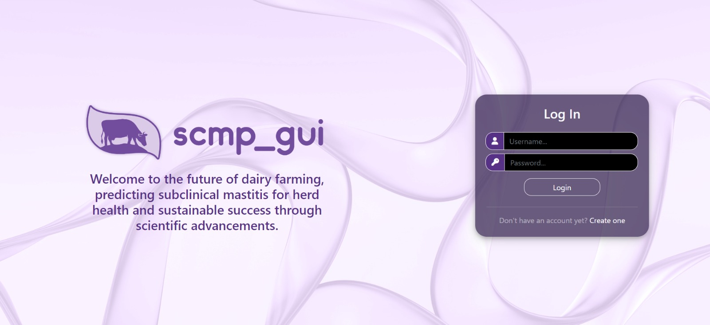
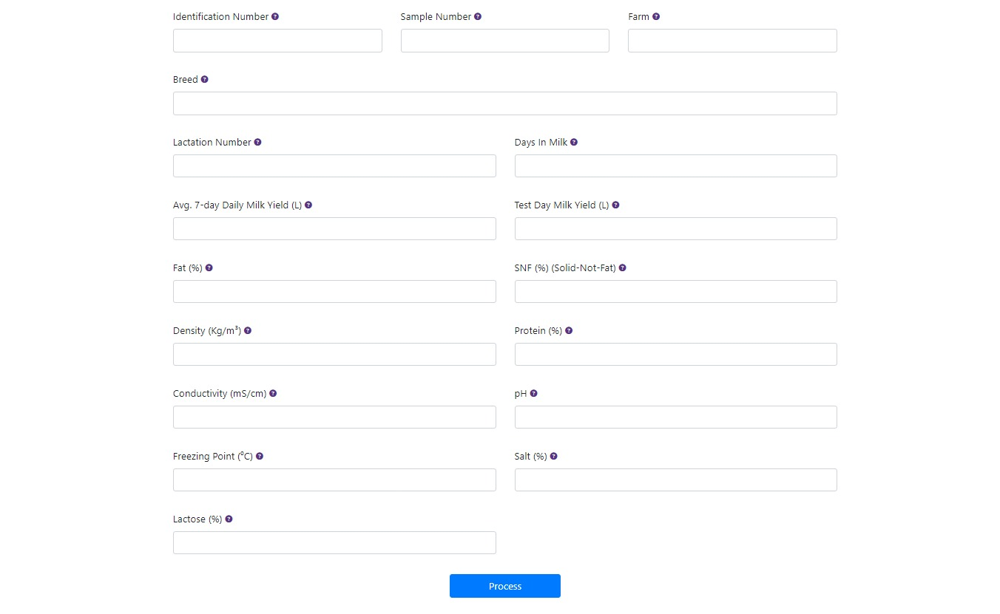
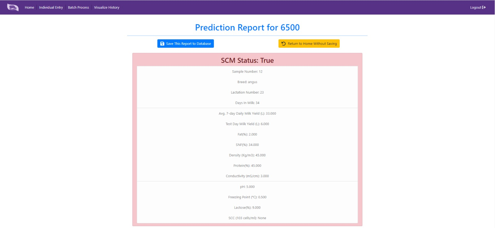
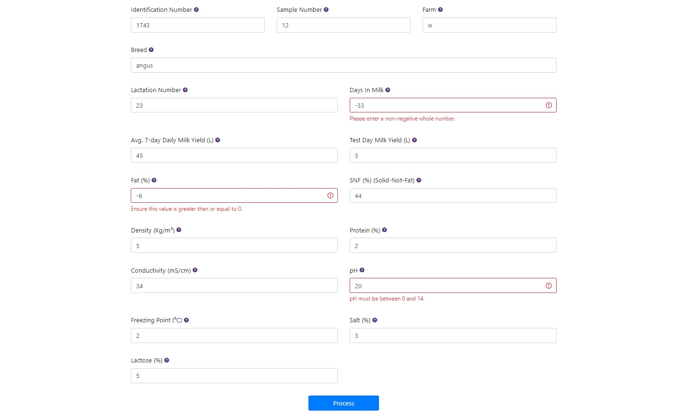
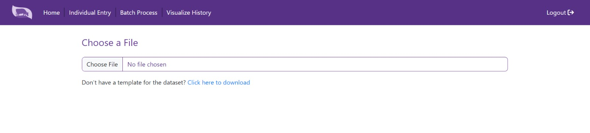
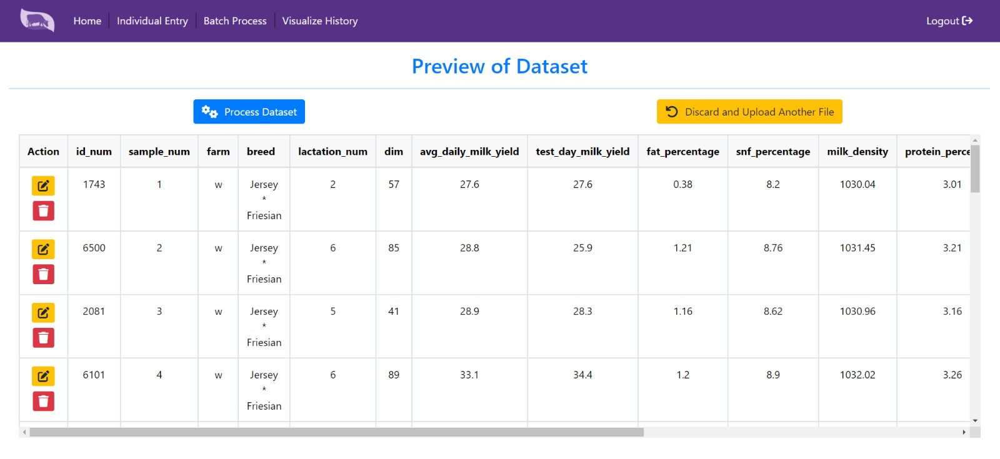
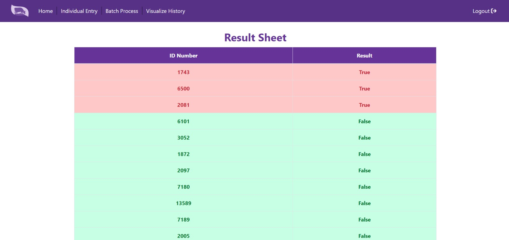

# A User-Friendly GUI for Subclinical Mastitis Prediction in Dairy Cows

<!-- 
This is a sample image, to show how to add images to your page. To learn more options, please refer [this](https://projects.ce.pdn.ac.lk/docs/faq/how-to-add-an-image/)

 -->


## Team
-  E/19/057, Colombage C.O., [email](mailto:e19057@eng.pdn.ac.lk)
-  E/19/205, Kumara I.P.S.N.U., [email](mailto:e19205@eng.pdn.ac.lk)
-  E/19/409, Udugamsooriya D.P., [email](mailto:e19409@eng.pdn.ac.lk)
-  E/19/455, Yashan W.V., [email](mailto:e19455@eng.pdn.ac.lk)

## Table of Contents
1. [Introduction](#introduction)
2. [Getting Started](#getting-started)
3. [Key Features] (#key-features)
4. [Links](#links)

---

## Introduction

In this project we aim to develop a user-friendly graphical user interface (GUI) that integrates a prediction model for subclinical mastitis in dairy cows. The software aims to provide dairy farm owners with an intuitive tool to manage their farms effectively. The GUI presents the prediction results in a user-friendly manner, enabling users to make informed decisions regarding herd health and milk production.

## Getting Started

To get started, you'll need to set up a Python virtual environment to ensure you're using the same dependencies as the project. This guide will walk you through the process on a Windows machine.

### Prerequisites

Before you begin, make sure you have the following prerequisites installed on your computer:

1. **Python:** Ensure you have Python 3.11 installed. If not, download and install it from the [official Python website](https://www.python.org/downloads/windows/).

### Setting Up the Virtual Environment

1. **Clone the Repository:**

   First, clone our project repository to your local machine. Open the terminal inside your desired location and clone the repository:

   ```shell
   git clone https://github.com/cepdnaclk/e19-co227-subclinical-mastitis-prediction-gui.git
   ```

2. **Navigate to the Repository Directory:**

   Change your current directory to the cloned repository:

   ```shell
   cd e19-co227-subclinical-mastitis-prediction-gui
   ```

3. **Create and Activate the Virtual Environment:**

   
   To create a virtual environment, run the following command:

   ```shell
   python -m venv venv
   ```

   This will create a virtual environment named "venv" in the repository directory.

   <mark>Please use 'venv' for the name of the virtual environment as it is already ignored from the gitignore.</mark>

   Next, activate the virtual environment:

   ```shell
   venv\Scripts\activate
   ```

   Your command prompt should now show the virtual environment name, indicating that you are working within it.

4. **Install Project Dependencies:**

   With the virtual environment activated, you can install the project's dependencies from the `requirements.txt` file:

   ```shell
   pip install -r requirements.txt
   ```

   This command will install all the required packages for the project.

5. **Contact the Project Owner for the .env File:**

   Our project uses a .env files to store sensitive information, such as Secret Keys. To run the project successfully, you'll need a copy of this file. Please contact one of the project owners to receive a copy of the .env file.

6. **Start Working on the Project:**

   You're all set! You can now start working on the project within the virtual environment. Any Python scripts you run or modifications you make to the project will use the isolated environment.

7. **Deactivate the Virtual Environment:**

   When you're done working on the project, you can deactivate the virtual environment by running:

   ```shell
   deactivate
   ```

   This will return you to your system's global Python environment.

Now you're ready to collaborate on our project. If you encounter any issues or have questions, please don't hesitate to reach out.

## Key Features

### User Authentication

The reason for implementing user authentication in this application is to safeguard valuable farm data from exposure.

The registration process has been streamlined; you only need to provide a username, email, and password in order to register. Subsequently, you can log in using your username and password.

<!-- two side by side images of register and login forms -->
<table>
  <tr>
    <td style="padding: 10px;"></td>
    <td style="padding: 10px;"></td>
  </tr>
</table> <br>

Users are unable to proceed beyond the login page without first logging in, and if not log out, will be automatically redirected to the home page. There is no need to log in every time when using the application.

### Individual Data Entry

When a user clicks on the individual data entry, the user will redirected to the individual data entry input form.

<!-- An image of individual data entry form-->
 

<br> In order to predict the subclinical mastitis state of a cow, it is essential to input every required parameter into the system using the provided input form during individual data entry. Then, the user can click on the "Process" button and get the sub-clinical mastitis state of the cow. Then, the user can find the SCM status along with the key parameters influencing this status. To enhance clarity, the prediction result is presented within a color-coded box. A red box signifies a positive SCM result (infection), while a green color indicates no infection. From here a user can save the input data to the database for historical data analyzation or Return to the home page without saving.

<!-- An image of prediction result sheet-->
 

<br> Each value entered by the user undergoes validation, and if a user enters a value outside the real-world limits for that parameter, the system promptly recognizes and indicates that the value is out of range. This prevents the user from processing inaccurate data. Furthermore, in the event that a user inadvertently enters an incorrect value, the system offers the user the convenience of identifying the specific field in which the error occurred. An out-of-range entry for a field is clearly indicated with red color, accompanied by an error message when the user attempts to process the data.

<!-- An image of error occured data entry form -->
 

### Batch data Import

Users can import data in batches from . XLSX files. This feature is developed for large farms with a large cattle group. The system checks for valid files and informs the user if a file is invalid. 

<!-- An image of batch data import page -->
 

<br> Then the user can see a preview of the dataset. Batch data import also provides the functionality for editing and save the data of any cow in the dataset if needed. Then user can also process the changed dataset.

<!-- An image of preview -->
 

<br> If data for specific rows, such as values for certain parameters of individual cows, falls outside the acceptable range, the system will promptly identify these discrepancies and highlight the corresponding lines in red.

<!-- An image of preview with out of range values -->
 

<br> Users can get the sub-clinical mastitis state of all the cows in the dataset at once by clicking on the "Process" button.

<!-- Image of batch process result -->
 

### Historical Data Visualization and Analysis

Users are provided with the ability to save the subclinical mastitis (SCM) status, along with other relevant parameters, directly from the result page. The historical data input page will then display graphs depicting 'Percentage of SCM-contaminated cows' and 'Days in Milk vs Average Daily Milk Yield' using the saved data. This feature enables farmers to gain a comprehensive understanding of the health status of their entire herd or a specific group within their herd. A user can view this historical data visualization by clicking on the "Historical Data Visualization" card.

<!-- two side by side images of historical data visualization -->
<table>
  <tr>
    <td style="padding: 10px;"></td>
    <td style="padding: 10px;"></td>
  </tr>
</table> <br>

## Links

- [Project Repository](https://github.com/cepdnaclk/e19-co227-subclinical-mastitis-prediction-gui)
- [Project Page](https://cepdnaclk.github.io/e19-co227-subclinical-mastitis-prediction-gui)
- [Department of Computer Engineering](http://www.ce.pdn.ac.lk/)
- [University of Peradeniya](https://eng.pdn.ac.lk/)
