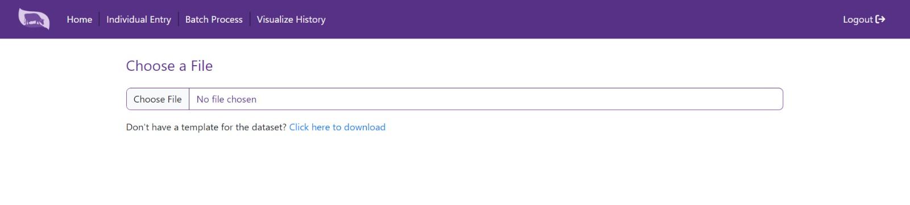

# Batch Data Import

## Introduction
The "Batch Data Import" feature allows users to efficiently import data in batches from .XLSX files. This feature is designed to cater to large farms with extensive cattle populations, simplifying the data input process. The system ensures the validity of the imported files and promptly notifies the user if any file is found to be invalid.

## Dataset Preview
Upon importing the data, users are provided with a convenient preview of the dataset. This preview feature not only simplifies the process of inspecting the data but also offers the functionality to edit and save data for individual cows within the dataset, should the need arise. This empowers users with flexibility and control over the imported data.

## Data Validation
To maintain data accuracy, the system includes a data validation mechanism. If values for specific rows, such as parameters of individual cows, fall outside the acceptable range, the system promptly identifies these discrepancies and highlights the corresponding lines in red. This ensures that the imported data remains within the acceptable bounds.

## Batch Processing
Users can conveniently obtain the subclinical mastitis (SCM) state for all cows within the dataset by simply clicking on the "Process" button. This streamlined batch processing feature saves time and provides comprehensive SCM assessments for the entire cattle group in a single operation.

