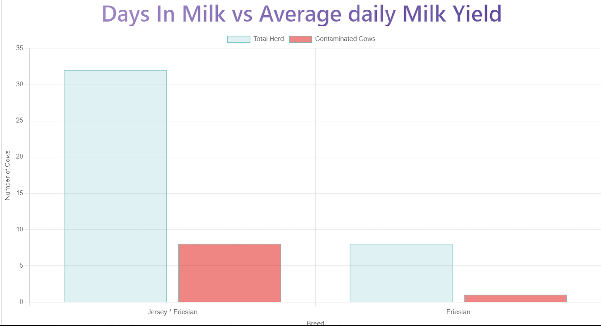
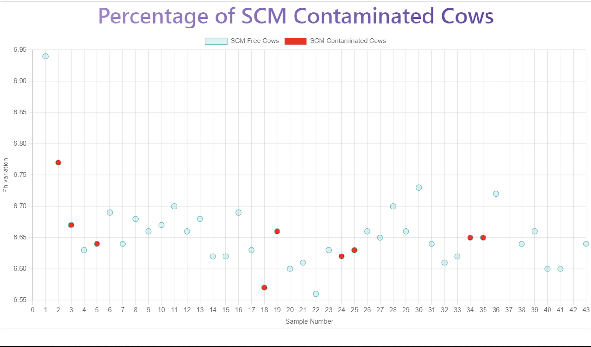

# Historical Data Visualization and Analysis

## Overview
Users have the ability to save the subclinical mastitis (SCM) status, along with other relevant parameters, directly from the result page. This historical data input is essential for tracking the health status of cows over time and enables users to gain a comprehensive understanding of their herd's health. The saved data is used to generate insightful visualizations, allowing farmers to analyze and monitor trends within their herd.

## Saving Historical Data
After receiving the SCM assessment results, users can choose to save the data directly from the result page. This data includes SCM status and key parameters, which are essential for future analysis.

## Historical Data Visualization
The historical data visualization page displays graphs that provide valuable insights into the health of the herd:

### Percentage of SCM-contaminated Cows
A graphical representation of the percentage of cows in the herd that are affected by subclinical mastitis. This data helps farmers assess the prevalence of SCM within their herd.

### Days in Milk vs Average Daily Milk Yield
A graph that compares the days in milk with the average daily milk yield of the cows. This analysis allows farmers to understand the relationship between lactation stage and milk production.

