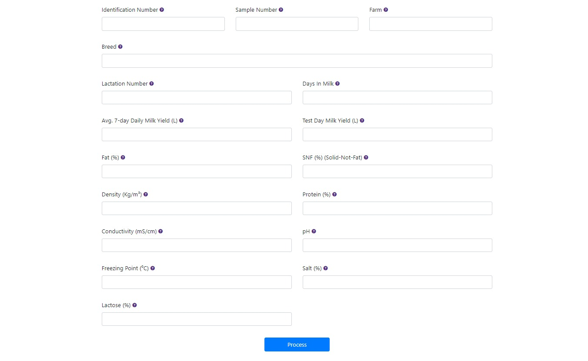
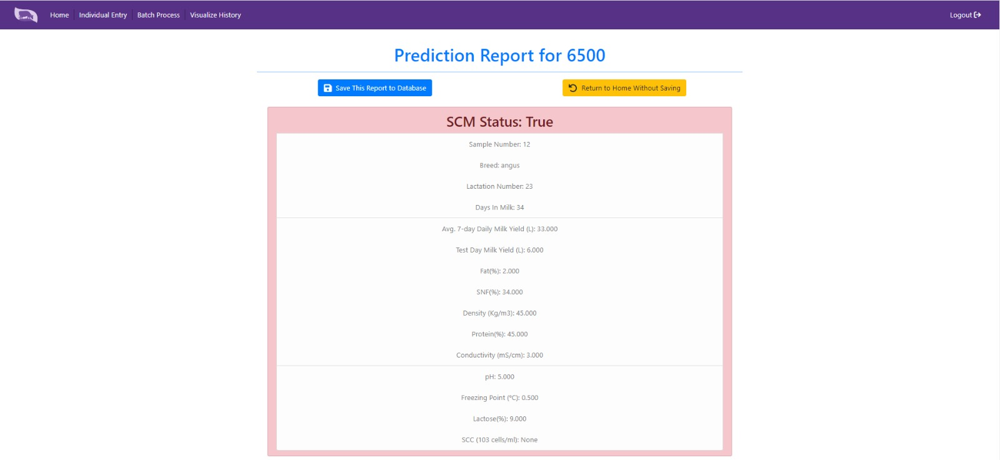
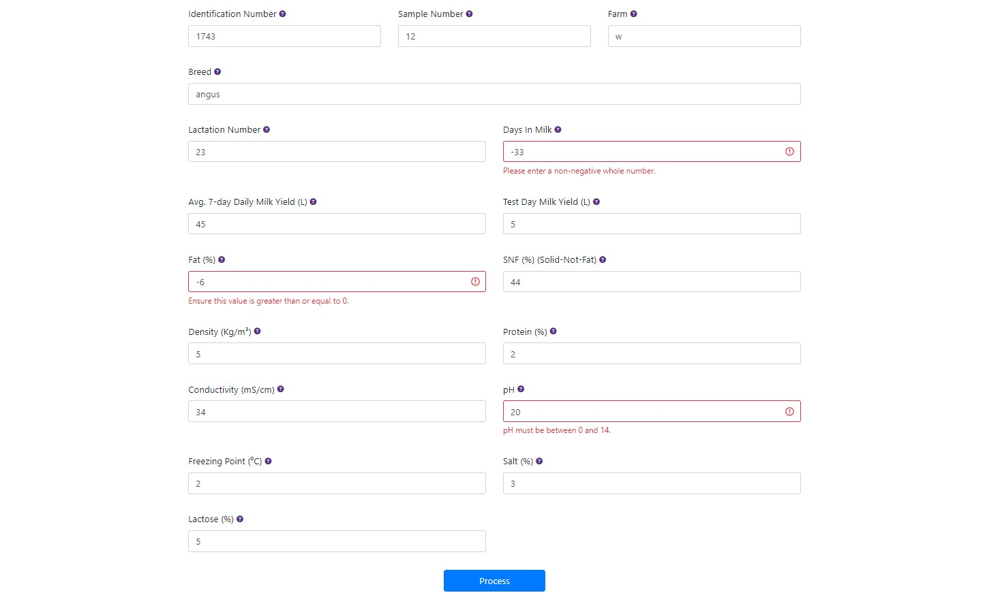

# Individual Data Entry

## Introduction
When a user clicks on the "Individual Data Entry" feature, they are redirected to the individual data entry input form. This form is a crucial component of the system, allowing users to input data required for predicting the subclinical mastitis (SCM) state of a cow.

## Data Input
To predict the subclinical mastitis state of a cow accurately, users must input all the necessary parameters into the system using the provided input form. This step is vital to obtain an accurate SCM assessment. Once all the data is entered, the user can proceed by clicking on the "Process" button.

## Prediction Result
After processing the data, the system provides the user with the subclinical mastitis state of the cow. Additionally, the user can access essential information about the key parameters influencing this state. To make the results clearer, they are presented within a color-coded box. A red box indicates a positive SCM result (indicating infection), while a green color signifies no infection. From this point, the user has two options: saving the input data to the database for historical data analysis or returning to the home page without saving.

## Data Validation
Each value entered by the user undergoes validation. If a user enters a value that falls outside the real-world limits for a specific parameter, the system promptly identifies and highlights that the value is out of range. This validation process is critical to prevent the processing of inaccurate data.

## Error Handling
In the event that a user inadvertently enters an incorrect value, the system offers the user the convenience of identifying the specific field where the error occurred. An out-of-range entry for a field is clearly indicated with a red color, accompanied by an error message when the user attempts to process the data.

