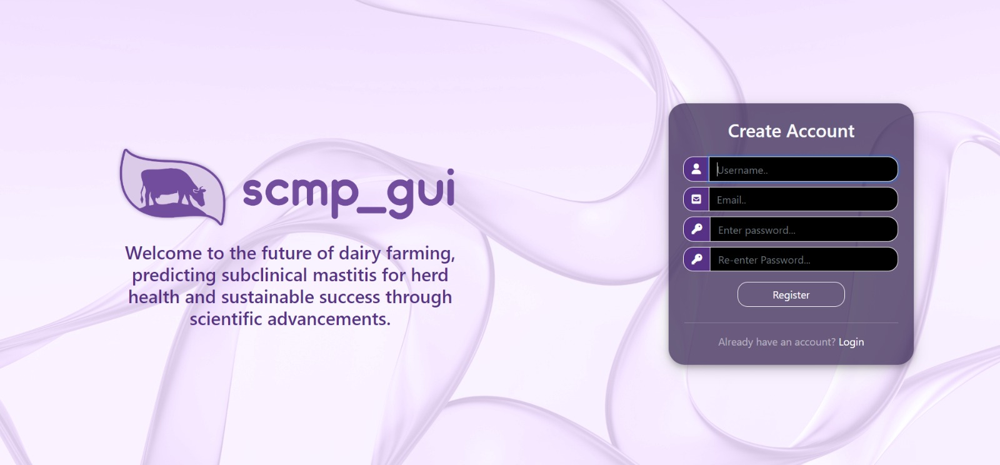
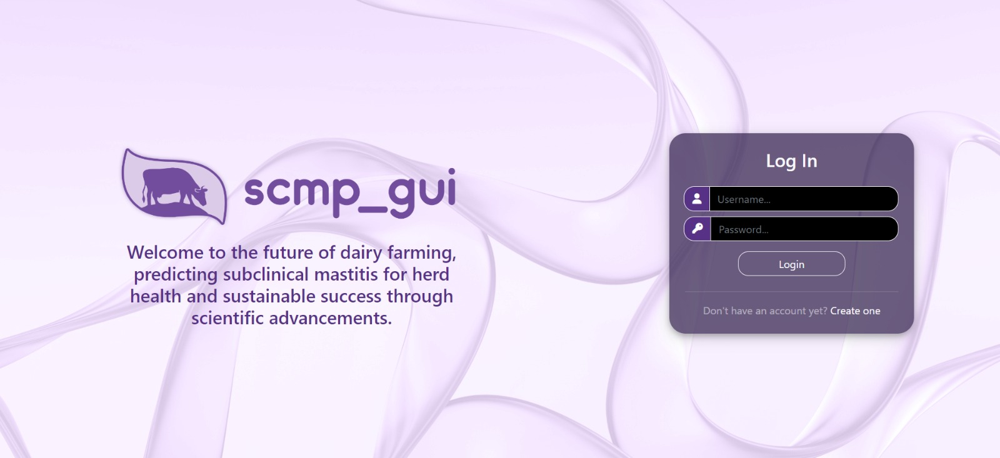

# User Authentication

## Introduction
User authentication is a fundamental security measure to protect valuable farm data from unauthorized access. It ensures that only authorized individuals can use the system.

## Registration

### Streamlined Registration
To create an account, simply provide a unique username, a valid email address, and a secure password.

### Registration Form

## Login

### User Login
Once registered, log in using your username and password.

### Login Form

### Automatic Login
Users are redirected to the home page after logging in. No need to log in every time you use the application.
